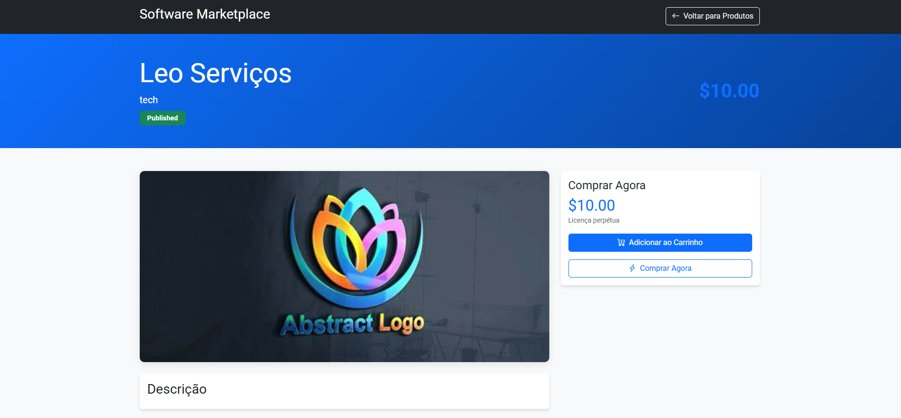

# Projeto Marketplace

Projeto feito utilizando Ruby on Rails e bootstrap

### Autenticação:

Uso da gem `devise-i18n`, uma das soluções mais completas e amplamente 
utilizadas na comunidade Ruby on Rails. O Devise oferece uma série de 
funcionalidades essenciais para a gestão de usuários.

- Esquema banco de dados

    
    
**CRUD de todos os modelos** 

- Tela de Login: → **POST**  `/users/sign_in`
    
    
    
- Tela de criação de usuário → **POST** `/users/sign_up`
    
   
    
- Tela principal
    
    
    
- Tela de detalhes de uma empresa → **GET** `/softwares/[:id]`
    
    
    
- Tela de Informações do usuário → **GET** `/users/current_user[:id]`
    
    
